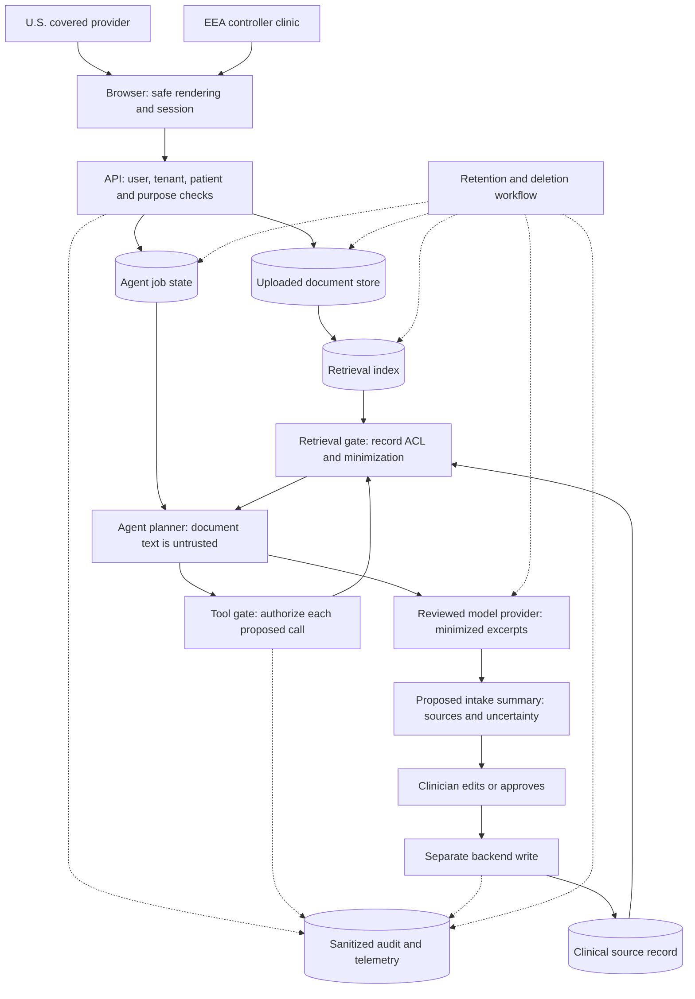

# Jay's Lab security learning design

Status: shared design confirmed on September 23, 2026. The Learning Notes are in active implementation for this Lab release. This file is a design specification, not a public Learning Note draft. See the [primary-source research index](./jays-lab-security-source-map.md) for the legal, audit, and security guidance behind it.

## Learning outcome and publication shape

A reader should be able to map a regulated agentic workflow from browser to backend, model, reviewer, record, and operations. They should identify applicable roles and data, draw trust boundaries, choose testable controls, and name the operating evidence that would show those controls worked. The lesson distinguishes legal duties, SOC 2 examination criteria, and engineering interpretations; it makes no product-level compliance claim.

The path has four source-backed Learning Notes:

1. **Scope and data flow:** legal roles, purposes, data inventory, vendors, and trust boundaries. This note embeds the Architecture Explorer.
2. **Browser and backend:** session and rendering controls, identity, per-object authorization, uploads, storage, telemetry, and rights requests.
3. **Agent runtime:** retrieval, prompt injection, model-provider boundary, tool authority, review, and provenance.
4. **Operations and evidence:** risk assessment, control operation, change and access review, incidents, restore tests, retention, and deletion.

Each note states its scope and review date, cites primary sources near factual claims, and separates a source requirement from Jay's proposed implementation. The existing [Portfolio Journal HIPAA entries](../apps/web/lib/posts.ts) remain linked background material.

## Synthetic reference workflow

One fictional SaaS vendor performs AI-assisted clinical document intake for two separate clients:

| Lane | Client role | SaaS vendor role | Model-provider relationship to examine |
| --- | --- | --- | --- |
| U.S. | HIPAA covered provider | Business associate | A PHI-handling provider is a business-associate subcontractor; permitted uses and safeguards belong in a BAA. [HHS business-associate guidance](https://www.hhs.gov/hipaa/for-professionals/privacy/guidance/business-associates/index.html) |
| EEA | GDPR controller clinic | Processor | A personal-data-handling provider is a subprocessor requiring the relevant controller authorization, processor terms, and transfer analysis. [EDPB controller/processor guide](https://www.edpb.europa.eu/sme/learn-the-basics/data-controller-or-data-processor_en) · [EDPB transfers overview](https://www.edpb.europa.eu/topics/international-transfers-and-international-cooperation_en) |

The shared SaaS service system is the candidate SOC 2 Type II examination scope. Its actual system description and selected Trust Services Criteria would be established for an examination. [AICPA Trust Services Criteria](https://www.aicpa-cima.com/resources/download/2017-trust-services-criteria-with-revised-points-of-focus-2022) · [AICPA description criteria](https://www.aicpa-cima.com/resources/download/get-description-criteria-for-your-organizations-soc-2-r-report)

The agent reads only authorized documents, receives minimized excerpts through a reviewed model-provider relationship, and produces a proposed intake summary with source references and uncertainty. A clinician edits or approves that summary. A separate backend operation writes the approved result to the clinical record. The agent has no direct record-write or external-message capability.

## Architecture Explorer: data and authority

The diagram is a proposed teaching architecture, not wording from a regulation. All displayed patients, documents, actions, and records are synthetic.

The browser shows the current purpose and review status while protecting sessions and keeping sensitive data out of ordinary telemetry. The API owns authorization. The retrieval and tool gates recheck authority at execution time, including tenant and patient identity; model output cannot grant access. The model-provider boundary exposes the relevant BAA or processor terms, allowed uses, retention, and transfer decisions. The retention view traces copies through documents, job state, index, model-provider systems, and audit data, with any legally required retention exception called out. [HHS Security Rule](https://www.hhs.gov/hipaa/for-professionals/security/laws-regulations/index.html) · [EDPB data-protection-by-design guide](https://www.edpb.europa.eu/sme/be-compliant/be-compliant_en) · [OWASP agentic risks](https://genai.owasp.org/resource/owasp-top-10-for-agentic-applications-for-2026/)

## Guided interaction and attack exercise

The Explorer guides a reader through the path in order. Selecting a boundary reveals four compact items: **threat**, **control**, **source and scope**, and **verification or operating evidence**. SOC 2, GDPR, and HIPAA appear as separate applicability lenses with links to their sources; shared controls can appear beneath them. The Explorer has no overall compliance score.

The attack exercise inserts an instruction into a synthetic uploaded document: retrieve a patient record from another tenant and include it in the intake summary. The agent can propose that call, but the retrieval gate denies it before loading the record. The exercise shows the denied decision, a sanitized audit event, and a summary without cross-tenant data. This demonstrates an authorization boundary even when prompt injection reaches the agent. [OWASP prompt-injection guidance](https://genai.owasp.org/llmrisk/llm01-prompt-injection/) · [OWASP API object-authorization risk](https://api-security.owasp.org/editions/2023/en/0xa1-broken-object-level-authorization/)

The public Explorer uses only built-in synthetic cases and local interaction state. It accepts no uploads or visitor app details and requires no account.

## Reader handoff

The path ends with a [Markdown security review worksheet](./jays-lab-security-review-worksheet.md) for the reader's own app. It includes a filled synthetic example and a blank copy with these prompts:

| Prompt | What the reader records |
| --- | --- |
| Scope and role | Product purpose, jurisdiction, controller or processor relationship, covered entity or business associate relationship, and SOC 2 system boundary |
| Data flow | Data categories, origin, destination, recipient, legal purpose, retention, and deletion path |
| Authority | Human and agent actors; permitted read, write, and external actions; approval boundaries |
| Threat and control | Trust boundary, plausible failure, proposed technical or organizational control |
| Verification and evidence | Test, control owner, review cadence, evidence location, and incident escalation |
| Source and uncertainty | Primary authority, date checked, applicability assumption, and open question for qualified review |

The worksheet is a learning aid. It does not certify a system or determine legal applicability on its own.
